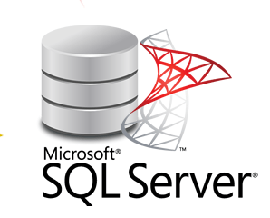
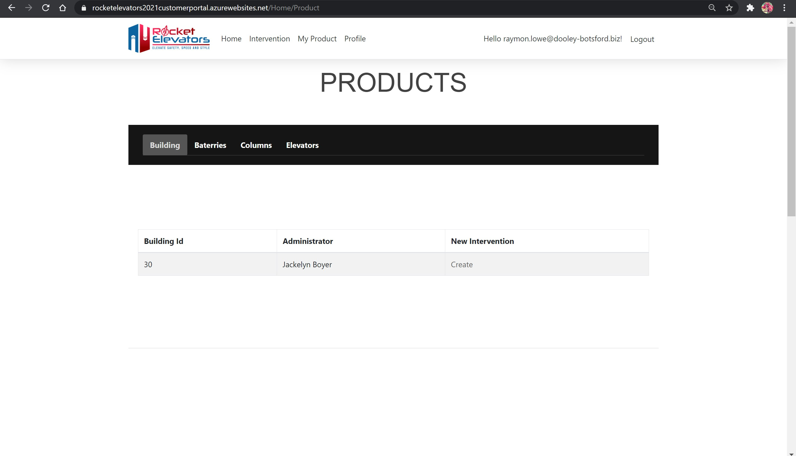

# Rocket Elevators Customer Portal 
-----------------------------------------------------------------------------------------------

## CodeBoxx Odissey - Week 11 - .NET Core

-----------------------------------------------------------------------------------------------
### Project by:
Diana dos Santos

[URL for the site:  https://rocketelevatorsportal.azurewebsites.net/Identity/Account/Login?ReturnUrl=%2F](https://rocketelevatorsportal.azurewebsites.net/Identity/Account/Login?ReturnUrl=%2F)

[Click here to see the presentation video](https://www.dropbox.com/s/f8zzdoxw7jsrsmb/Week%2011%20-%20Understanding%20the%20dotNET%20Framework.mkv?dl=0)

(To style Readme presentation: https://www.markdownguide.org/basic-syntax/#headings)

-----------------------------------------------------------------------------------------------

# [(This is the repository for the item 3, mentioned in this Readme file. To access the repository, for the Rocket Elevators Customer Portal, that has the items 1, 2, 4 and 5 mention in this Readme, please click in this link)](https://github.com/diana-dsantos/Rocket_Elevators_Customer_Portal)

-----------------------------------------------------------------------------------------------

This week deliverables:

## 1) Create a new portal, specially for Rocket Elevators's customers;

login: blake@ryan.co
login: henriette@lynch-kling.net
login: rodrick.boyer@tremblay-reichel.org
login: gaye@grant.biz
login: eddie@bailey.net  /  password: 123456

### Sign Up and Sign In page

### Home page, once signed in

## 2) Create a new SQL database, specially for this portal, that should contain only the login and password informations about the client;
   

## 3 new Rest API end points:

## 3.A) GET: to verify if the email from login page already exists in the MySQL database. If it exists, so the client will have access to this portal;

## 3.B) GET: to retrieve informations from the client that are in the main Rocket Elevators's database (MySQL), like his/her buildings, batteries, columns, elevators;

## 3.C) PULL: for all customer's informations

## 4) A page for Intervention, in this new portal, where the client will be able to create his/her own interventions;

## 5) A page for the client's products, in this new portal, where the client will be able to consult the informations about his/her products and also it will be possible to create an interventions from this page, that will lead the selected and sent informations, to the page Intervention and then it will be possible to create a description and submit the form; 

## 6) A page for the customer's profile informations, in this new portal, where the user can update any information;

-----------------------------------------------------------------------------------------------

# Rocket Elevators Rest API 
-----------------------------------------------------------------------------------------------

## CodeBoxx Odissey - Week 9 - Consolidation

-----------------------------------------------------------------------------------------------

This repo serves as the Rocket Elevators REST API developed for CodeBoxx's week 8 of the Odyssey program. We were tasked with developing a REST API to interact with the MYSQL database that already exists, and provide the appropriate requests for queries.

The queries for the REST API are found in a public PostMan workspace at: https://app.getpostman.com/join-team?invite_code=f09613b7a24e69fef5524a5d3f5f434e&ws=1c76f8ec-a244-4f00-9317-ee95973e1306

The REST API URL is: https://week-8-restapi-apibehavioroptions-kaelenburroughs.azurewebsites.net/

Each request works as follows:

1. GET Batteries - Returns the information for a specific battery, and different batteries can be returned by changing the number at the end of the API request.

2. GET Batteries Status - Returns the current status of the queried battery.

3. PUT Batteries Status - Changes the status of the queried battery to either 'Active', 'Inactive', or 'Intervention'.

4. GET Columns - Returns the information for a specific column, and different columns can be returned by changing the number at the end of the API request.

5. GET Columns Status - Returns the current status of the queried column.

6. PUT Columns Status - Changes the status of the queried column to either 'Active', 'Inactive', or 'Intervention'.

7. GET Elevators - Returns the information for a specific elevator, and different elevators can be returned by changing the number at the end of the API request.

8. GET Elevators Status - Returns the current status of the queried elevator.

9. PUT Elevators Status - Changes the status of the queried elevator to either 'Active', 'Inactive', or 'Intervention'.

10. GET Elevators List Not Active - Returns a list of elevators that do not have a status of 'Active'.

11. GET Buildings List Intervention - Returns a list of all the buildings that have a battery, column, or elevator with a status of 'Intervention'.

12. Get Leads (all) - Returns a list of all the leads in the database.

