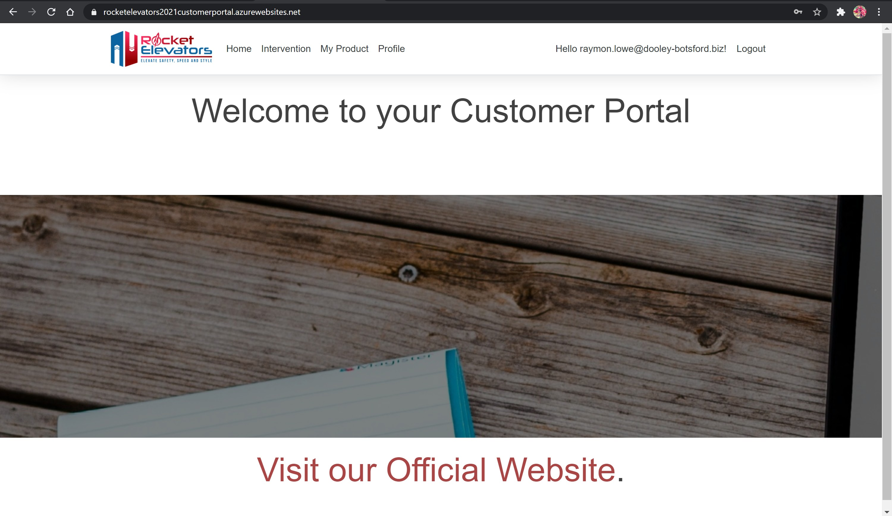

# Rocket Elevators Customer Portal 
-----------------------------------------------------------------------------------------------

## CodeBoxx Odissey - Week 11 - .NET Core

-----------------------------------------------------------------------------------------------
### Project by:
Diana dos Santos

[URL for the site:  https://rocketelevatorsportal.azurewebsites.net/Identity/Account/Login?ReturnUrl=%2F](https://rocketelevatorsportal.azurewebsites.net/Identity/Account/Login?ReturnUrl=%2F)

[Click here to see the presentation video](https://www.dropbox.com/s/f8zzdoxw7jsrsmb/Week%2011%20-%20Understanding%20the%20dotNET%20Framework.mkv?dl=0)

(To style Readme presentation: https://www.markdownguide.org/basic-syntax/#headings)

-----------------------------------------------------------------------------------------------

# [(This is the repository for the item 3, mentioned in this Readme file. To access the repository, for the Rocket Elevators Customer Portal, that has the items 1, 2, 4 and 5 mention in this Readme, please click in this link)](https://github.com/diana-dsantos/Rocket_Elevators_Customer_Portal)

-----------------------------------------------------------------------------------------------

This week deliverables:

## 1) Create a new portal, specially for Rocket Elevators's customers;

login: blake@ryan.co
login: henriette@lynch-kling.net
login: rodrick.boyer@tremblay-reichel.org
login: gaye@grant.biz
login: eddie@bailey.net  /  password: 123456
### Sign Up and Sign In page

### Home page, once signed in
